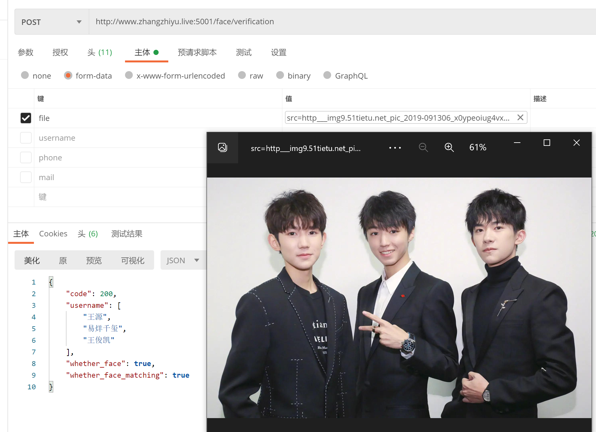

# 使用docker直接运行
> 基于face-recognition,postgresql数据库制作的人脸识别镜像
> 下载docker可以直接拉取使用  不需要下载依赖配置环境等




### 依赖

依赖postgresql数据库

官方的cube类型受限，要使用docker安装扩容版的postgresql数据库

 amd64架构： 

```bash
docker pull registry.cn-hangzhou.aliyuncs.com/zzy_pi/postgresql-large-cube:11.2-alpine
```

arm64架构：

```bash
docker pull registry.cn-hangzhou.aliyuncs.com/zzy_pi/postgresql-large-cube-arm64
```
如何运行请[查看](http://www.zhangzhiyu.live:8900/vuepress/guide/python/PostgreSQL%E7%89%88%E4%BA%BA%E8%84%B8%E6%A3%80%E7%B4%A2.html#docker%E4%B8%8B%E8%BD%BDpostgresql)

可使用脚本文件初始化库，或自行设置

```python
import psycopg2


def setup_db():
    conn = psycopg2.connect(database="face", user="数据库账号", password="数据库密码", host="数据库域名或IP", port="5432")
    db = conn.cursor()
    db.execute("create extension if not exists cube;")
    db.execute("drop table if exists vectors")
    db.execute("create table vectors (id serial, username varchar,phone varchar ,mail varchar ,vec_data cube);")
    db.execute("create index vectors_vec_idx on vectors (vec_data);")
    db.execute("ALTER TABLE 'public'.'vectors' ADD PRIMARY KEY ('id');")
    conn.commit()
    conn.close()

setup_db()
```


拉取镜像

amd64架构：
```bash
docker pull registry.cn-hangzhou.aliyuncs.com/zzy_pi/face_postgresql:v1
```

arm64架构：
```bash
docker pull registry.cn-hangzhou.aliyuncs.com/zzy_pi/face_postgresql_arm64::v1
```

运行命令

```bash
docker run  --env dbhost="数据库ip或域名" --env dbuser="数据库账号" --env dbpassword="数据库密码" -p 5001:5001 face-recognition
```

### 接口说明

#### 人脸注册

域名:端口/face/registration  (Post请求)仅支持Formdata格式

参数:

| 键       | 含义                                  | 备注                                          |
| -------- | ------------------------------------- | --------------------------------------------- |
| file     | 需注册的人脸图片（仅支持jpg,jpeg,png) | 尽量上传高清图像（0.5M-4M）否则将影响识别质量 |
| username | 人脸名                                | 调用识别接口时会返回这个                      |
| phone    | 手机号                                | 可不填                                        |
| mail     | 邮箱                                  | 可不填                                        |

回调

| 键             | 含义             | 备注               |
| -------------- | ---------------- | ------------------ |
| code           | 接口是否成功调用 | 200成功 500失败    |
| msg            | 失败原因         | 仅code=500才会出现 |
| face_encodings | 是否成功         | 成功回调“成功”     |


#### 人脸验证

参数
域名:端口/face/verification (Post请求)仅支持Formdata格式

| 键   | 含义                                  | 备注 |
| ---- | ------------------------------------- | ---- |
| file | 需识别的人脸图片（仅支持jpg,jpeg,png) |      |

回调

| 键                    | 含义               | 备注                                                         |
| --------------------- | ------------------ | ------------------------------------------------------------ |
| code                  | 接口是否成功调用   | 200成功 500失败                                              |
| msg                   | 失败原因           | 仅code=500才会出现                                           |
| whether_face          | 是否识别到人脸     | 仅code=200才会出现，ture或false                              |
| whether_face_matching | 人脸是否和库匹配到 | 仅code=200才会出现，ture或flase                              |
| username              | 该人脸在库中的姓名 | 仅code=200才会出现，whether_face和whether_face_matching都为ture时回调名字，否则回调flase |


#### 查询样本库人员

域名:端口/face/all   (Get请求)

回调

| 键       | 含义             | 备注     |
| -------- | ---------------- | -------- |
| code     | 接口是否成功调用 | 200成功  |
| all_face | 库中所有人员姓名 | 数组形式 |


